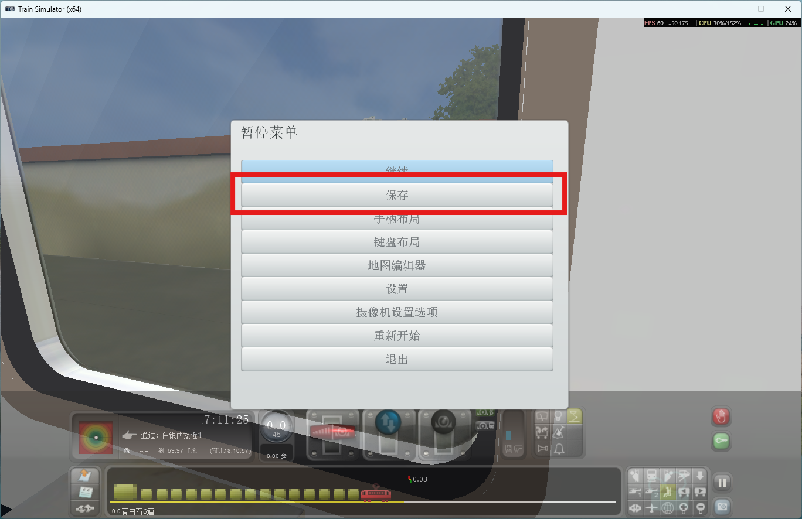
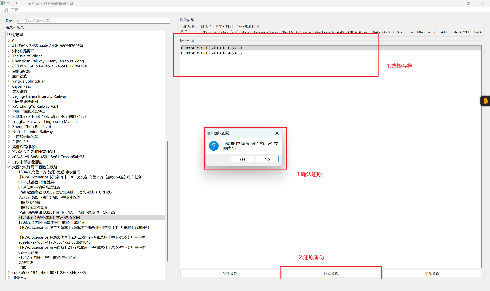

[中文](./README.md) | English

# Train Simulator Classic Save Backup Management Tool

A save backup management tool specifically designed for DTG Train Simulator Classic, addressing the limitation where Train Simulator Classic games can only overwrite save files within the same scenario. This tool helps players easily backup, restore, and manage game saves.

## Installation

### Method 1: Use Pre-compiled Executable (Recommended)

1. Download the latest executable `TrainSimulatorBackup.exe` from Releases
2. Run directly from source code, Python environment installation required

### Method 2: Run from Source Code

1. **Install Python Dependencies**

   ```bash
   pip install -r requirements.txt
   ```
2. **Run Program**

   ```bash
   python train_simulator_backup_tool.py
   ```

### Method 3: Package with PyInstaller

1. **Install Packaging Tool**

   ```bash
   pip install pyinstaller
   ```
2. **Execute Packaging Script**

   ```bash
   python build_exe.py
   ```
3. **Get Executable File**

   - After packaging is complete, the executable is located at `dist/TrainSimulatorBackup.exe`

## Usage Instructions

### First Time Use

1. **Launch Program** - Run `TrainSimulatorBackup.exe`
2. **Set Game Path** - Menu Bar → File → Set RailWorks Path
3. **Select Game Directory** - Browse to RailWorks installation directory (directory containing Railworks.exe, Railworks64.exe, or RailworksDX12_64.exe)
4. **Auto Scan** - Program will automatically scan all routes and scenarios

### Feature Usage Instructions

1. Open the game, during gameplay press F2 or select "Save" from the pause menu to save your game progress.
2. After completing this operation, open TrainSimulatorBackup, find the scenario you just saved, click "Create Backup", and the save backup will be created by default in the Saves folder of the scenario directory.
   
3. To restore a save, select the created item from the backup list and choose "Restore Backup" to restore the save.

   
4. To delete, select the corresponding backup item and click "Delete Backup".

## Backup File Description

### File Naming Format

- Backup file naming: `CurrentSave-YYYY-mm-dd-HH-MM-SS.bin`
- Example: `CurrentSave-2025-01-01-14-30-25.bin`

### Storage Location

- Backup files are stored in the `saves` folder within the scenario directory
- Path structure: `[Scenario UUID]/saves/CurrentSave-[timestamp].bin`

### Backup Strategy

- Support multiple backup versions for the same scenario
- Backup files are sorted by creation time in descending order (newest first)
- Backup files can be safely deleted without affecting normal game saves

## Technical Implementation

### Core Components

1. **ConfigManager** - Configuration File Management

   - Save game path settings
   - Persist user preferences
2. **XMLParser** - XML Parser

   - Parse RouteProperties.xml and ScenarioProperties.xml
   - Support multilingual display name parsing
   - Intelligent fallback mechanism
3. **TrainSimulatorBackupTool** - Core Business Logic

   - Auto-detect RailWorks path
   - Content scanning and parsing
   - Backup creation, restoration, and deletion operations
4. **GUI Interface** - Graphical User Interface

   - Modern interface based on PyQt5/PyQt6
   - Responsive layout design
   - Complete user interaction workflow

### Compatibility Support

- **Python Version**: 3.10 - 3.14
- **GUI Library**: PyQt5, PyQt6, GTK3
- **Operating System**: Windows (Primary Support)
- **Game Version**: Train Simulator Classic Steam Edition

## Troubleshooting

### Common Issues

#### Q: Program cannot detect game path

**A**:

1. Manually set path: Menu → File → Set RailWorks Path
2. Ensure the selected directory contains `Railworks.exe`, `Railworks64.exe`, or `RailworksDX12_64.exe`

#### Q: Route or scenario names display as UUIDs

**A**:

1. Check if XML files are corrupted or missing
2. Ensure game file integrity
3. Try rescan (Tool → Rescan Content)

#### Q: Backup creation failed

**A**:

1. Ensure sufficient disk space
2. Check if game is running (close game and retry)
3. Ensure write permissions for game directory

#### Q: Game cannot read saves after restoration

**A**:

1. Backup file may be corrupted, try other backup
2. Ensure backup file is compatible with current game version
3. Check game directory permissions

### Main Dependencies

- **PyQt5/PyQt6**: GUI Framework
- **xml.etree.ElementTree**: XML Parsing (Python Standard Library)
- **pywin32**: Windows Registry Access
- **pyinstaller**: Packaging Tool

### License

This project uses MIT License, see LICENSE file for details.

### Disclaimer

This tool is for personal learning and backup purposes only, and has no affiliation with Dovetail Games. Please comply with relevant game terms of use and copyright regulations.

Some source code is written by AI and has been reviewed and corrected by the author.
